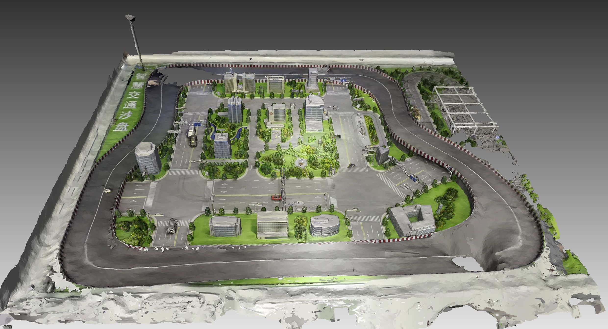
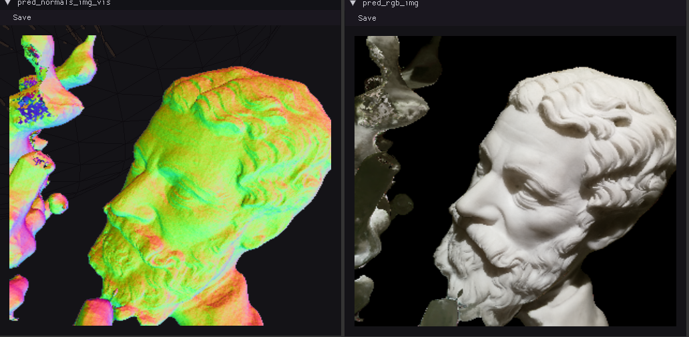
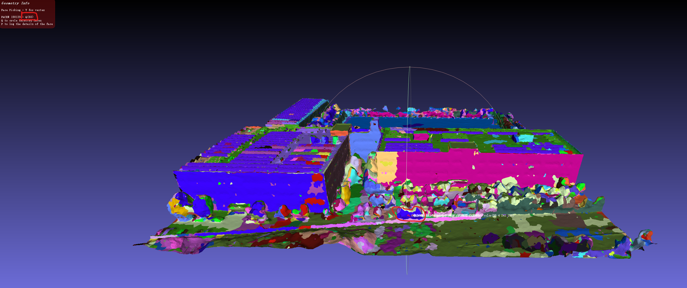
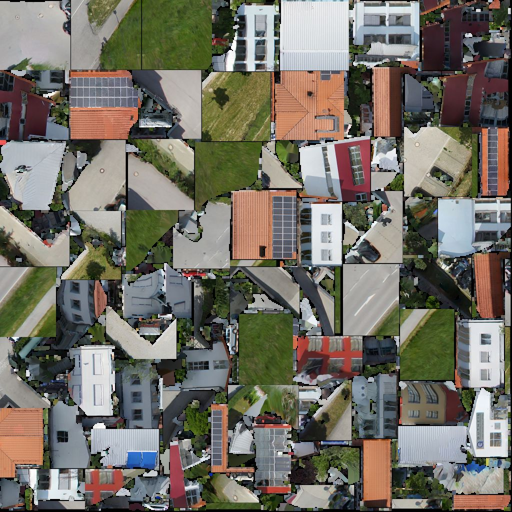

# 欢迎来到我的demo页面

## 高斯
### 室内场景

|改进方案| 原版高斯 |
|:----:|:----:|
|<video width="320" controls> <source src="video/改进方案.mp4" type="video/mp4"> </video>|<video width="600" controls> <source src="video/原方案.mp4" type="video/mp4"> </video>|

### 室外场景改进
<video width="600" controls> <source src="video/depth-gs.mp4" type="video/mp4"> </video>

### 大场景

<video width="600" controls> <source src="video/光明科学城.mp4" type="video/mp4"> </video>

### 高斯三角网

Rade-GS SDF

<video width="480" controls> <source src="video/rade-gs-sdf.mp4" type="video/mp4"> </video>

Rade-GS Possion

<video width="480" controls> <source src="video/rade-gs-possion.mp4" type="video/mp4"> </video>
## Nerf/NueS

### bakedlangelo

<video width="480" controls> <source src="video/bakedlangelo-1.mp4" type="video/mp4"> </video>

### Permuto sdf

## 语义分割
<video width="480" controls> <source src="video/mesh-seg.mp4" type="video/mp4"> </video>

## 传统三维重建

### 纹理映射view slection

### 节省像素atlas package

