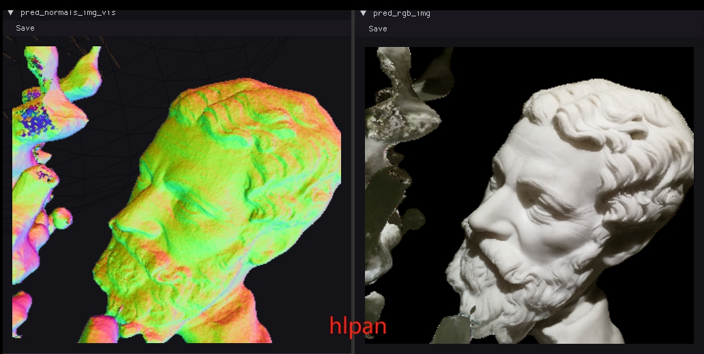
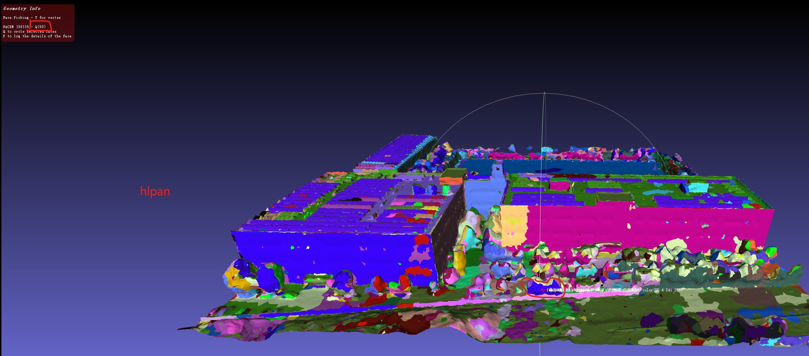
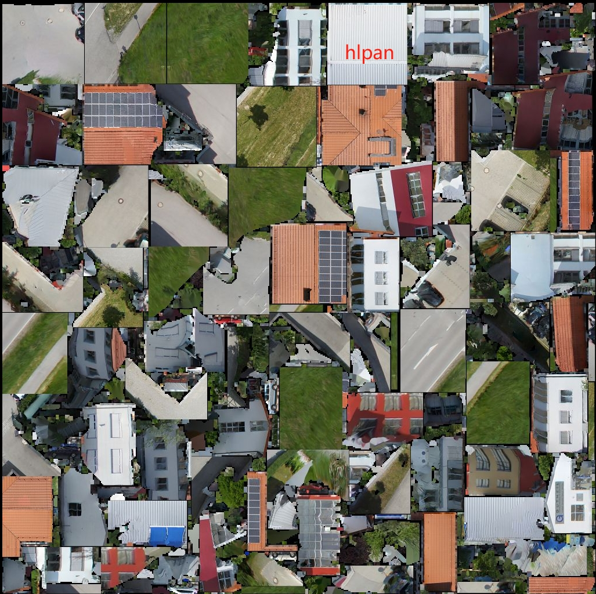
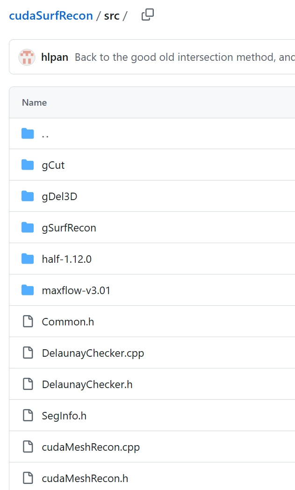
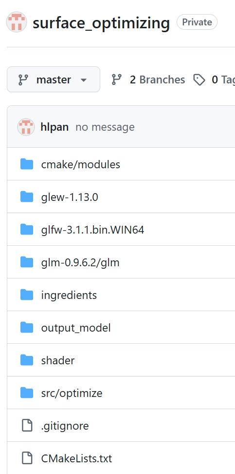

# 欢迎来到hlpan的demo页面

## 📚 目录

- [高斯](#高斯)
  - [室内场景](#室内场景)
  - [室外场景改进](#室外场景改进)
  - [大场景](#大场景)
  - [高斯三角网](#高斯三角网)
- [Nerf/NueS](#nerfnues)
  - [bakedlangelo](#bakedlangelo)
  - [Permuto sdf](#permuto-sdf)
- [语义分割](#语义分割)
- [传统三维重建](#传统三维重建)
  - [纹理映射 view selection](#纹理映射view-slection)
  - [节省像素 atlas package](#节省像素atlas-package)
  - [CUDA网格生成](#CUDA网格生成)
  - [CUDA网格优化](#CUDA网格优化)
---

## 高斯
### 室内场景

|改进方案| 原版高斯 |
|:----:|:----:|
|<video width="320" controls> <source src="water-mark/room-new.mp4" type="video/mp4"> </video>|<video width="600" controls> <source src="water-mark/room-old.mp4" type="video/mp4"> </video>|

### 室外场景改进
<video width="600" controls> <source src="water-mark/depth-gs.mp4" type="video/mp4"> </video>

### 大场景

<video width="600" controls> <source src="water-mark/outdoor-lod-gs.mp4" type="video/mp4"> </video>

### 高斯三角网

Rade-GS SDF

<video width="480" controls> <source src="water-mark/rade-gs-sdf.mp4" type="video/mp4"> </video>

Rade-GS Possion

<video width="480" controls> <source src="water-mark/rade-gs-possion.mp4" type="video/mp4"> </video>
## Nerf/NueS

### bakedlangelo

<video width="480" controls> <source src="water-mark/bakedlangelo-1.mp4" type="video/mp4"> </video>

### Permuto sdf

## 语义分割
<video width="480" controls> <source src="water-mark/mesh-seg.mp4" type="video/mp4"> </video>

## 传统三维重建

### 纹理映射view slection

### 节省像素atlas package

### CUDA网格生成

### CUDA网格优化

